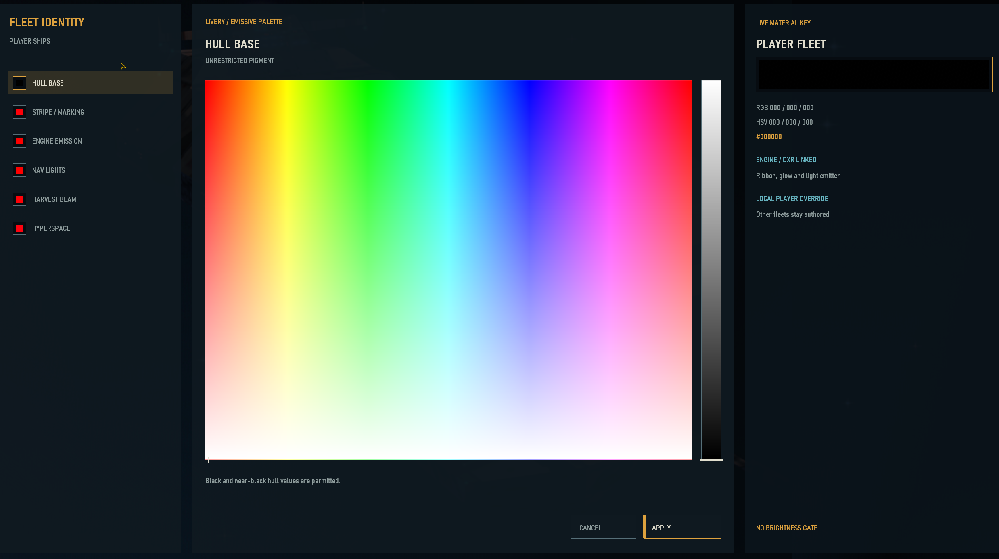
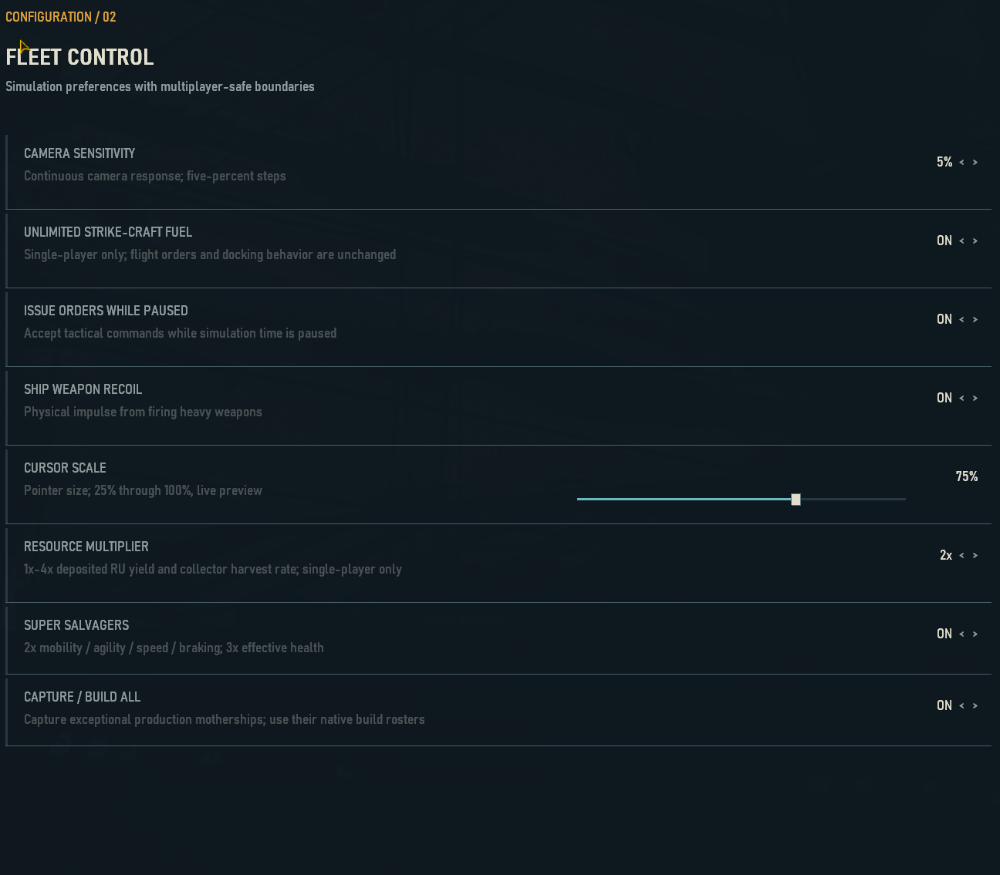

# Homeworld RTX

> [!CAUTION]
> ## REQUIRED FOR EVERY NEW EXTRACT
> Before the first launch, manually copy your legally owned `HW_Music.wxd` and
> `HW_Comp.vce` into the **same folder as `HomeworldModern.exe`**. The current
> first-run verification does not find these two archives reliably in their
> original installation folder. On Steam, they are normally in
> `Homeworld1Classic\Data`. Do not download or redistribute these retail files.


[](https://github.com/dovahkiinjeff/Homeworld-RTX/releases)
[](#requirements)
[](#graphics)
[](docs/LIMITATIONS.md)

Homeworld RTX is a non-commercial Windows source port and graphics overhaul of
the original 1999 Homeworld. It preserves the classic campaign, simulation,
ships, controls, and data while adding a native Direct3D 12 presentation path,
DXR multi-bounce lighting, modern display support, a responsive interface, and
live authoring tools for maps, mission lighting, shadows, and volumetric dust.

> [!IMPORTANT]
> This repository and its releases do **not** contain the retail game archives,
> music, speech, or movies. You must own Homeworld 1 Classic and supply the two
> audio archives described in the required step above.

> [!WARNING]
> This is a Windows x64 beta. It is not affiliated with, endorsed by, or
> supported by Gearbox, Relic Entertainment, Sierra On-Line, NVIDIA, or Valve.
> Homeworld and related marks belong to their respective owners.

## Download and quick start

1. Open the [0.91.3 public beta 4 release](https://github.com/dovahkiinjeff/Homeworld-RTX/releases/tag/v0.91.3-beta.4).
2. Download `Homeworld-RTX-v0.91.3-beta.4-Windows-x64.zip`.
3. Extract the ZIP to a normal writable folder. Do not run it from inside the ZIP.
4. From your legal Homeworld Classic installation, copy `HW_Music.wxd` and
   `HW_Comp.vce` into the extracted folder beside `HomeworldModern.exe`.
5. Run `HomeworldModern.exe`.
6. At the first-start picker, select your legally installed Homeworld Classic
   `Homeworld.exe`.

Supported data sets:

- Homeworld Remastered Collection - `Homeworld1Classic` data
- Original 1999 Homeworld data, preferably patched to 1.05

The Remastered Collection Classic data requires `Homeworld.big`,
`HW_Comp.vce`, and `HW_Music.wxd`. Original 1999 data additionally benefits
from `Update.big`. For this beta, the two audio archives must be copied beside
the RTX executable even though they remain part of your retail installation.
A legal `Movies` folder enables the pre-mission animatics.

See the [complete installation and user guide](docs/USER_GUIDE.md) for display
modes, controls, graphics tuning, save locations, and diagnostics.

## Project showcase

[](https://www.youtube.com/watch?v=R4PvuIpeAaA)

Watch the [Homeworld RTX project showcase](https://www.youtube.com/watch?v=R4PvuIpeAaA)
for an extended look at the renderer, restored assets, fleet-scale battles, and
the project in motion. GitHub READMEs cannot play iframe video inline, so the
full-width preview opens the video directly on YouTube.

Ship texture authors can use the non-destructive
[ships-only batch upscaling pipeline](docs/SHIP_TEXTURE_UPSCALING.md). It applies
AI restoration only to hull/albedo images while protecting team-color,
emissive, material-mask, normal-map, and alpha data.

## Fleet Identity - six systems, one coherent palette



Fleet Identity turns the old color picker into a full livery and emissive
control center. It is deliberately direct: choose a channel on the left, pick
any hue and saturation in the large field, set value with the vertical slider,
watch the RGB/HSV/hex material key update live, and select **Apply**. There are
no hidden minimum-brightness rules, so black and near-black hull colors work.

The six independently selectable channels are:

| Channel | What it controls |
| --- | --- |
| **Hull Base** | Primary player-ship pigment across the fleet |
| **Stripe / Marking** | Secondary livery and team markings |
| **Engine Emission** | Engine ribbons, nozzle glow, and the linked DXR light emitter |
| **Nav Lights** | Player navigation-light sprites and point emitters |
| **Harvest Beam** | Player beam color, nozzle glow, and line-light emission |
| **Hyperspace** | Player gate, slice, field effect, and matching DXR emission |

For the four effect channels, a single switch chooses between the original
authored color and a custom player color. The visible raster effect and its
ray-traced light use the same selection automatically: there is no second
lighting menu to synchronize. Overrides apply only to the local player fleet;
allied and enemy fleets retain their authored identities.

## Capture / Build All - stolen factories become working factories



In plain English: **yes, you can capture an enemy carrier or mothership and
then build ships from it.** Enable **Capture / Build All** on the Fleet Control
page, successfully salvage an exceptional enemy production ship, and the
captured hull joins your owned factory selector with its native build roster.
Turanic and Kadeshi production ships can therefore become functional parts of
your fleet instead of oversized trophies.

The option respects the identity of the stolen factory: ships are created from
that factory's native roster and race, not converted into the player's ordinary
roster. Turning the option off does not confiscate captured hulls, and already
queued construction can finish; it simply hides foreign factories from new
build selection and blocks new foreign-factory orders until re-enabled. This is
a single-player feature and does not alter multiplayer's deterministic,
owner-race production rules.

## Highlights

### Graphics

- Native Windows x64 executable with Direct3D 12/DXGI presentation.
- Experimental native D3D12 fixed-function compatibility rasterizer.
- DXR scene extraction from the exact visible meshes and transforms.
- Progressive path-traced direct light and up to three diffuse bounces.
- Mission-sky environment radiance, HSF map lights, dynamic FX lights,
  emissive LIF materials, and active MEX navigation lights.
- Depth-validated motion reprojection, disocclusion rejection, temporal
  accumulation, spatial filtering, and firefly control.
- Capability-based Auto reconstruction: DLAA/DLSS on NVIDIA, XeSS-SR on
  Intel, and FidelityFX Native AA/FSR on AMD and other supported adapters.
- Explicit DLAA/DLSS, FSR Native/Quality/Balanced/Performance, XeSS
  AA/Quality/Balanced/Performance, universal temporal AA, FXAA, and Off modes.
- Full-scene temporal inputs use corrected jitter, depth, motion, history reset,
  and stationary-normal stability; the UI remains native resolution.
- Four-times-resolution ship hull textures are stored as mipmapped BC7 DDS;
  dedicated BC5 tangent-space normal maps replace resolution-dependent runtime
  relief generation, while fleet masks use compact BC4 DDS.
- Release ship DDS assets are served from a single memory-mapped, indexed
  `HomeworldTextures.hwt` archive to avoid thousands of filesystem opens during
  mission loading. Developers can opt into loose DDS priority with
  `HW_LOOSE_TEXTURE_OVERRIDES=1`; release builds avoid those filesystem probes.
- Ray-traced soft shadows with editable sun size, ray counts, biases, contact
  reinforcement, and maximum range.
- Optional bloom, god rays, motion blur, chromatic aberration, film grain, and
  output dithering, with the UI kept outside scene post-processing.
- World-locked FP16 volumetric dust with stable 3D density, depth-aware ship
  occlusion, local and mission lighting, ship wakes, noise-displaced authoring
  boundaries, and editable map-wide distance fade controls.
- Four replacement asteroids use projected-size LOD chains derived from those
  same authored meshes, preserving their silhouettes in dense mission fields.
- Highest-detail ship LOD0 policy, stable zoom, modern cursor scaling, and the
  original campaign BTG skies with modern lighting metadata.

### Interface and gameplay

- Resolution-aware 16:9, ultrawide, 4K, and high-DPI interface scaling.
- Rebuilt front end, campaign screens, options, modal dialogs, and in-game
  Build, Research, and Launch docks.
- Ship Dossier with loaded statistics and Fleet Archive descriptions.
- Full HSV fleet palette, including true black.
- Independent engine-trail, navigation-light, harvesting-beam, and hyperspace
  color overrides; visible effects and their DXR emission stay synchronized.
- Optional single-player quality-of-life modes: unlimited strike-craft fuel,
  Super Salvagers, Capture / Build All, and a 1x-4x resource multiplier.
- Captured enemy carriers and exceptional production motherships can retain
  their native build rosters and operate as player-controlled factories.
- Presentation frame rate is separated from the fixed simulation clock.

### Live authoring tools

- **Shift+F11 - Map Editor:** browse legal BIG archives, place and transform
  ships/resources, hide original objects through non-destructive overlays,
  author raymarched dust volumes, manage reusable cloud presets, and export
  portable `.rtxmap` files.
- **Shift+F12 - Lighting Editor:** edit the mission key and ambient wash,
  import retail HSF lights, add point/spot/ambient lights, place and aim them
  in the viewport, tune global materials/exposure, and edit ray-traced shadows.
- `kas2c.exe` and its source are retained for mission-script development.
- Human-readable exports are written beneath `RTXExports` beside the executable.

The detailed [authoring guide](docs/EDITING_GUIDE.md) documents every page,
field, shortcut, output path, and safe workflow.

## Requirements

Minimum practical requirements for the beta:

- 64-bit Windows 10 or Windows 11
- A legally installed copy of Homeworld 1 Classic
- Direct3D 12-capable GPU and current vendor driver
- DXR-capable GPU for path tracing and ray-traced shadows
- A compatible NVIDIA GPU for DLAA/DLSS; AMD FidelityFX and Intel XeSS-SR
  runtimes are packaged for AMD/Intel and cross-vendor reconstruction
- Approximately 2 GB free space for extraction, logs, and shader cache

Non-DXR hardware can run the D3D12 presentation/raster path with path tracing
disabled. Auto selects an available backend and explicit unsupported temporal
modes fall back safely instead of preventing the game from rendering.

## Essential controls

| Control | Action |
| --- | --- |
| `Shift+F11` | Toggle the live map and volumetric editor |
| `Shift+F12` | Toggle the live lighting/shadow editor |
| `Ctrl+Shift+F12` | Reset the renderer |
| Right-click with ships selected | Open the tactical menu and Ship Dossier |
| Mouse wheel | Camera zoom; editor fly movement when Shift+F11 is open |

Both editors are designed for mouse use and also expose keyboard workflows.
See [Editing Guide](docs/EDITING_GUIDE.md#shortcut-reference).

## Documentation

- [Installation and User Guide](docs/USER_GUIDE.md)
- [Map, Lighting, Shadow, and Volumetric Editing Guide](docs/EDITING_GUIDE.md)
- [Known Limitations and Beta Expectations](docs/LIMITATIONS.md)
- [Native Windows Build Guide](Windows/BUILD_MODERN.md)
- [Graphics Feature Status](documentation/GRAPHICS_FEATURE_STATUS.md)
- [Renderer Architecture and Roadmap](documentation/MODERN_RENDERER_ROADMAP.md)
- [Original Source Baseline](documentation/ORIGINAL_SOURCE_BASELINE.md)
- [Third-Party Notices](THIRD_PARTY_NOTICES.md)
- PDF manual attached to each GitHub release

## Building from source

Install Visual Studio 2022 or 2026 with Desktop development with C++, then run
from a Developer PowerShell:

```powershell
./Windows/bootstrap.ps1
./Windows/build.ps1 -Configuration Release
```

The bootstrap obtains pinned dependencies and NVIDIA Streamline 2.12.0, checks
the Streamline archive digest, and keeps the vcpkg build tree in a no-space
directory beneath LocalAppData. Generated dependencies and build outputs are
not committed.

The build produces `HomeworldModern.exe`, its PDB symbols, required DLLs,
project assets, and `kas2c.exe`. Full details are in
[Windows/BUILD_MODERN.md](Windows/BUILD_MODERN.md).

## Beta status

This release is intended for testing, authoring, and community development.
The Windows/D3D12/DXR path is the active target. Linux and macOS are not
supported by this branch. HDR output, Reflex, genuine frame generation,
specular ray transport, and complete native-raster parity
remain future work. Read [Known Limitations](docs/LIMITATIONS.md) before filing
a report.

## Reporting problems

Include the mission, exact steps, GPU/driver, display mode, graphics settings,
and the diagnostic ZIP produced by `Windows/run-with-log.ps1`. Please do not
upload retail Homeworld archives, movies, voice files, or music.

## License and ownership

The original Homeworld source baseline is governed by the Relic source-code
agreement in [LICENSE.txt](LICENSE.txt), including its non-commercial terms.
Third-party components retain their own licenses. Project documentation and
new work do not grant rights to Homeworld retail data, imagery, audio, movies,
or trademarks. Review [THIRD_PARTY_NOTICES.md](THIRD_PARTY_NOTICES.md).

This project is distributed free of charge and without warranty.
